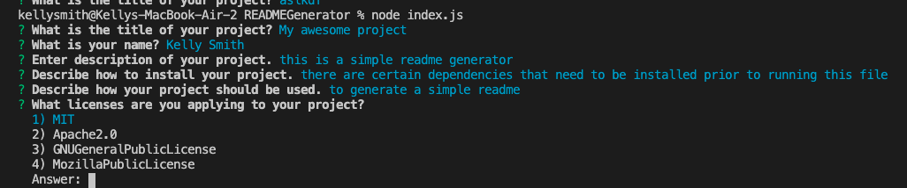

# README Generator

### GitHubRepo:  https://github.com/kellys-tech/READMEGenerator
### Video: https://youtu.be/ZUtEsdeVQoU

*This is a simple README generator. When this file is run using node js, the user will be prompted with a series of questions related to their project. When all questions have been answered, a README.MD file will be generated in an output file. This is so this project README is not overwritten. The generated README will contain all information that the user entered, including a badge for the license that was selected.*

## Weather Dashboard created using:
* Javascript
* Node js fs module
* NPM package inquirer
* NPM package utils

## Features
### How to use
* The user will run this program in their terminal by entering `node index.js`
* See Dependencies for a list of installs needed to run this program successfully

### Input
* User input
   * User is prompted with a series of questions, one at a time.
   * When a user enters their answer and hits enter, the user will be prompted with the next question.

### License Selection
* The user will be asked which license they prefer to use for their project. The user can select from a list of licenses.
* The user will enter the number of the license option they wish to choose.

### Output
* When the user has answered all of the questions, they will see a message in the terminal that the file was successfully written.
* The file is written to the 'output' directory

### Dependencies
* User should create a gitignore file and store the following:
- .DS_Store
- node_modules
- package.json
- package-lock.json

* User will need to install the following packages
- `npm init -y`
- `npm install inquirer`
- `npm i utils --save`

### Screenshots

* see output folder for README created from using Generator